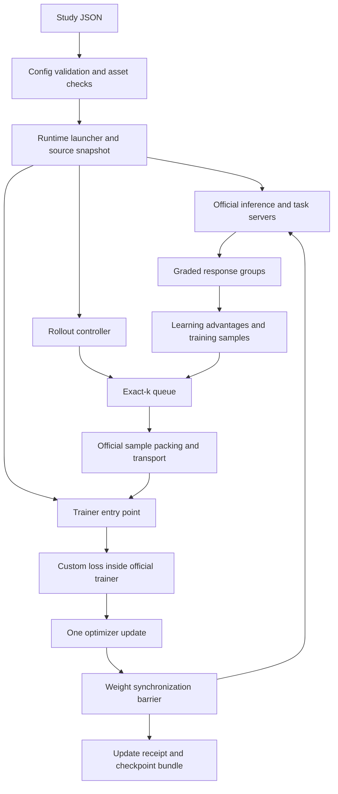

# Code layout and execution flow

The public entry point is `deepseek-study`. Run settings live in `recipe.py` and `config.py`; implementation is grouped by concern. Files under `vendor/` are imported dependencies and are not edited by this package.

```text
deepseek14b-exact-staleness/
├── src/
│   ├── deepseek_study/
│   │   ├── __init__.py
│   │   ├── cli.py
│   │   ├── config.py
│   │   ├── recipe.py
│   │   ├── learning/
│   │   │   ├── advantages.py
│   │   │   └── loss.py
│   │   ├── rollouts/
│   │   │   ├── queue.py
│   │   │   ├── controller.py
│   │   │   └── audit.py
│   │   ├── dataset/
│   │   │   ├── assets.py
│   │   │   ├── prepare.py
│   │   │   ├── rewards.py
│   │   │   ├── grading.py
│   │   │   └── worker.py
│   │   ├── tracking/
│   │   │   └── runboard.py
│   │   └── runtime/
│   │       ├── build.py
│   │       ├── launcher.py
│   │       ├── trainer.py
│   │       ├── trainer_state.py
│   │       ├── checkpoints.py
│   │       └── identity.py
│   └── deepseek_deepscaler/
│       └── __init__.py
├── configs/
├── manifests/
├── scripts/
├── tests/
├── diagnostics/
└── docs/
```

Each subpackage also has an empty `__init__.py`. `vendor/`, `assets/`, `outputs/` and `dist/` are local generated directories excluded from Git.

## Where each responsibility lives

| Area | Responsibility | Boundary |
| --- | --- | --- |
| `cli.py`, `config.py`, `recipe.py` | Commands, validated settings and baseline values | Choosing a lag does not schedule a sweep |
| `learning/` | Group advantages and clipped GRPO loss | Does not schedule rollouts or launch processes |
| `rollouts/queue.py` | Exact-k state machine and finite horizon | Uses a backend interface; contains no PrimeRL imports |
| `rollouts/controller.py` | Implements that backend with official PrimeRL components | Checks provenance and applies weights at explicit barriers |
| `rollouts/audit.py` | Validates recorded update ages and accounting | Reads completed-update evidence; does not train |
| `dataset/` | Asset identity, prepared question selection, reward policy and isolated grading workers | Infrastructure failures are distinct from incorrect answers |
| `deepseek_deepscaler/` | Verifiers taskset adapter | Connects questions/rewards to the official task API |
| `runtime/build.py` | Converts the study config to real PrimeRL configs | Config resolution launches no workers |
| `runtime/launcher.py` | Preflight, source snapshot, process startup and shutdown | Only the `run` command starts training |
| `runtime/trainer.py`, `trainer_state.py` | Trainer entry point, seed setup and RNG checkpoint adapter | Official trainer still performs forward/backward and optimizer steps |
| `runtime/checkpoints.py`, `identity.py` | Atomic state bundles, retention and immutable source/runtime identity | Recovery requires the same scientific/source identity |
| `tracking/runboard.py` | Runboard observer, metric mapping and saved-log imports | Reads journals and completion markers in a separate CPU process; does not call training or evaluation |

## Execution flow



Generation of a future cohort can overlap the current update. Inference weights change only after that cohort finishes. Every consumed cohort causes one optimizer update after all packed microbatches accumulate. The first `k` updates are labeled on-policy bootstrap; subsequent cohorts have exact age `k`. The tail drains without unused generation.

The controller composes the official dispatcher, sink, packer, transports and watcher. It does not start the automatic newest-weight watcher or the stock orchestrator training/evaluation loop. See [imported-library integration](upstream-integration.md) for the exact boundaries and runtime override.

The launcher also starts a Runboard observer from the source snapshot. Existing file-monitor metrics, study journals and completed-checkpoint markers feed this process; its failure does not fail training. Runboard performs delivery in its own sender thread. The launcher records terminal status after stopping training services, then allows a bounded observer drain. See [tracking behavior and metric clocks](runboard.md).

## Read and change in this order

1. Read [recipe.py](../src/deepseek_study/recipe.py) and [config.py](../src/deepseek_study/config.py) to understand the fixed experiment.
2. Read [queue.py](../src/deepseek_study/rollouts/queue.py) and the [worked example](review-guide.md#algorithm-contract) to understand age.
3. Read [advantages.py](../src/deepseek_study/learning/advantages.py), [loss.py](../src/deepseek_study/learning/loss.py) and [rewards.py](../src/deepseek_study/dataset/rewards.py) to understand the learning signal.
4. Read [controller.py](../src/deepseek_study/rollouts/controller.py), then [runtime/](../src/deepseek_study/runtime/), to review execution and recovery.
5. Read the [research audit](staleness-research-audit.md) before interpreting training logs as scientific results.

The CPU suite checks contracts and behavior. Full 14B execution, live model-weight transfer, memory fit and actual training/resume remain unverified. Held-out evaluation, richer tail diagnostics and explicit sample-to-response mapping remain research work; reorganizing the modules does not implement them.

## Paper diagnostics data path

`tracking/tokens.py` observes detached tensors at PrimeRL's existing export hook and atomically writes one compressed shard per rank/update. `tracking/observer.py` waits for the controller's completed-update receipt; `tracking/paper.py` then computes global statistics over the union of trainer shards. `tracking/archive.py` mirrors journals and immutable metric artifacts to XFS. `tracking/runboard.py` sends the scalar results to the dashboard. `tracking/evaluation.py` imports independently generated offline predictions with benchmark and checkpoint provenance. None of these modules adds a term to the GRPO loss.
